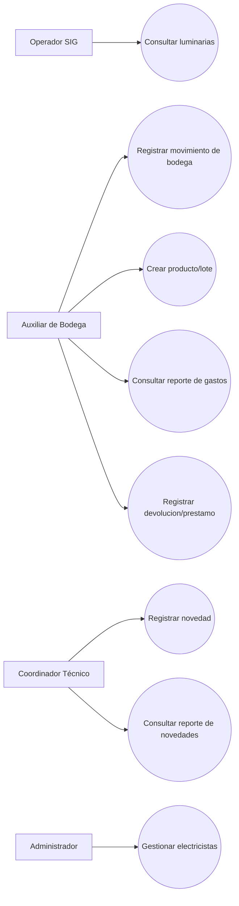
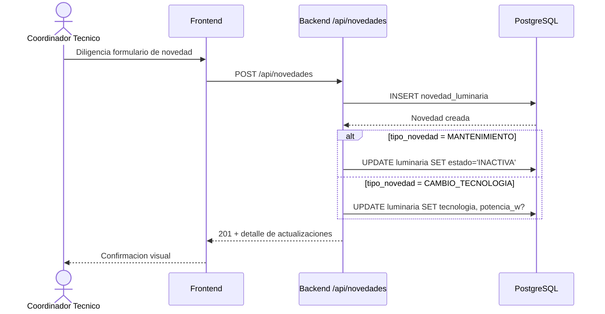
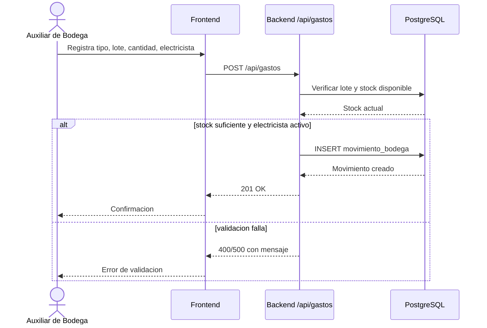

# Casos de Uso del Sistema

## 1. Propósito
Este documento describe los casos de uso principales del Sistema de Gestión de Luminarias e Inventario de Bodega, incluyendo actores, precondiciones, flujos y diagramas.

## 2. Alcance
El alcance cubre los módulos observables en el código actual:
- Consulta de luminarias
- Registro de novedades
- Gestión de inventario y movimientos
- Gestión de electricistas
- Reportes operativos

## 3. Actores
- Operador SIG: consulta luminarias en mapa.
- Auxiliar de Bodega: administra inventario, lotes y movimientos.
- Coordinador Técnico: registra novedades y consulta reportes.
- Administrador: gestiona electricistas y parámetros básicos.
- API Backend: ejecuta reglas de negocio y persistencia.
- Base de Datos PostgreSQL: almacena información operativa.

## 4. Diagrama general de casos de uso

## 5. Catálogo de casos de uso

### UC-01 Consultar luminarias
- Actor principal: Operador SIG
- Objetivo: visualizar luminarias y su ubicación para diagnóstico operativo.
- Precondiciones: sistema en línea y datos de luminarias disponibles.
- Disparador: el actor abre el módulo de mapa.
- Flujo principal:
1. El actor abre el dashboard SIG.
2. El sistema consulta luminarias en backend.
3. El sistema muestra luminarias y permite aplicar filtros.
4. El actor selecciona una luminaria para ver detalle.
- Flujos alternos:
1. Si falla la consulta, se muestra mensaje de error.
2. Si no hay resultados, se muestra estado vacío.
- Postcondición: luminarias consultadas sin modificar datos.

### UC-02 Registrar novedad de luminaria
- Actor principal: Coordinador Técnico
- Objetivo: registrar una intervención técnica sobre una lámpara.
- Precondiciones: la lámpara existe o es identificable por número.
- Disparador: el actor diligencia formulario de novedad.
- Flujo principal:
1. El actor ingresa número de lámpara y tipo de novedad.
2. El actor completa fecha y observación.
3. El sistema registra la novedad.
4. Si aplica, el backend actualiza estado o tecnología de la luminaria.
5. El sistema confirma la creación.
- Reglas relevantes:
1. Para MANTENIMIENTO, la luminaria puede quedar en estado INACTIVA.
2. Para CAMBIO_TECNOLOGIA, se actualiza la tecnología y eventualmente la potencia.
- Postcondición: novedad persistida con trazabilidad.

### UC-03 Registrar movimiento de bodega
- Actor principal: Auxiliar de Bodega
- Objetivo: registrar entradas/salidas de inventario por lote.
- Precondiciones:
1. Existe un lote válido.
2. Existe electricista activo.
- Disparador: el actor registra un movimiento.
- Flujo principal:
1. El actor selecciona lote, tipo y cantidad.
2. El actor selecciona electricista responsable.
3. El sistema valida datos y stock disponible (si es salida).
4. El sistema registra el movimiento.
5. El sistema refleja stock calculado en consultas.
- Flujos alternos:
1. Stock insuficiente para DESPACHADO/PRESTADO/MATERIAL_EXCEDENTE.
2. Electricista inexistente o inactivo.
- Postcondición: movimiento persistido y trazable.

### UC-04 Crear producto/lote de inventario
- Actor principal: Auxiliar de Bodega
- Objetivo: registrar nuevos elementos para operación.
- Precondiciones: datos mínimos del producto/lote completos.
- Flujo principal:
1. El actor crea producto (si no existe).
2. El actor crea lote asociado con cantidad y costo.
3. El sistema guarda y habilita uso en movimientos.
- Postcondición: inventario base disponible para despacho.

### UC-05 Gestionar electricistas
- Actor principal: Administrador
- Objetivo: mantener catálogo de electricistas activos/inactivos.
- Precondiciones: actor con permisos operativos.
- Flujo principal:
1. El actor lista electricistas.
2. Crea o actualiza estado de un electricista.
3. Asigna o remueve inventario de electricista.
- Postcondición: catálogo actualizado para operaciones de bodega.

### UC-06 Consultar reporte de novedades
- Actor principal: Coordinador Técnico
- Objetivo: analizar intervenciones y costos asociados.
- Flujo principal:
1. El actor abre reporte de novedades.
2. Aplica filtros por fecha/tipo/texto.
3. El sistema presenta resultados y totales.
- Postcondición: información disponible para seguimiento técnico.

### UC-07 Consultar reporte de gastos generales
- Actor principal: Auxiliar de Bodega
- Objetivo: visualizar consumo de materiales y costo neto.
- Flujo principal:
1. El actor abre reporte de gastos.
2. Aplica filtros por rango de fechas y tipo de movimiento.
3. El sistema muestra detalle y costo neto.
- Postcondición: visibilidad financiera operativa consolidada.

### UC-08 Registrar devolución o préstamo
- Actor principal: Auxiliar de Bodega
- Objetivo: controlar préstamos y devoluciones por lote.
- Precondiciones: lote existente; para devolución, despacho previo relacionado.
- Flujo principal:
1. El actor selecciona flujo de PRESTADO o DEVOLUCION.
2. Registra cantidad y referencia operativa.
3. El sistema valida consistencia y guarda movimiento.
- Postcondición: trazabilidad de saldos en préstamos.

## 6. Matriz resumida de reglas
| Regla | Descripción |
|---|---|
| RN-01 | Todo movimiento de bodega debe tener electricista activo. |
| RN-02 | No se permiten salidas con stock insuficiente. |
| RN-03 | Tipos válidos de movimiento: ENTRADA, DESPACHADO, DEVOLUCION, MATERIAL_EXCEDENTE, PRESTADO. |
| RN-04 | En CAMBIO_TECNOLOGIA se normaliza tecnología y puede inferirse potencia. |
| RN-05 | Una novedad con movimientos asociados no debe editarse libremente. |

## 7. Trazabilidad (caso de uso -> endpoint)
| Caso de uso | Endpoint principal |
|---|---|
| UC-01 Consultar luminarias | GET /api/luminarias |
| UC-02 Registrar novedad | POST /api/novedades |
| UC-03 Registrar movimiento | POST /api/gastos |
| UC-04 Crear producto/lote | POST /api/inventario/productos, POST /api/inventario/lotes |
| UC-05 Gestionar electricistas | GET/POST/PUT /api/electricistas |
| UC-06 Reporte novedades | GET /api/novedades (y consultas relacionadas) |
| UC-07 Reporte gastos | GET /api/gastos |
| UC-08 Devoluciones/Préstamos | POST /api/gastos con tipo_movimiento correspondiente |

## 8. Notas
- Los diagramas Mermaid son compatibles con VS Code, GitHub y motores Markdown con soporte Mermaid.
- Este documento refleja el comportamiento observable en la versión actual del repositorio (10-03-2026).
