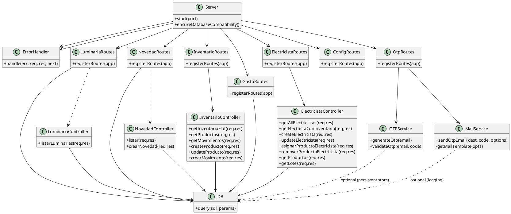

```plantuml
@startuml
skinparam classAttributeIconSize 0

class Server {
  +start(port)
  +ensureDatabaseCompatibility()
}

class DB {
  +query(sql, params)
}

class ErrorHandler {
  +handle(err, req, res, next)
}

class LuminariaRoutes {
  +registerRoutes(app)
}
class NovedadRoutes {
  +registerRoutes(app)
}
class InventarioRoutes {
  +registerRoutes(app)
}
class GastoRoutes {
  +registerRoutes(app)
}
class ElectricistaRoutes {
  +registerRoutes(app)
}
class ConfigRoutes {
  +registerRoutes(app)
}
class OtpRoutes {
  +registerRoutes(app)
}

class ElectricistaController {
  +getAllElectricistas(req,res)
  +getElectristaConInventario(req,res)
  +createElectricista(req,res)
  +updateElectricista(req,res)
  +asignarProductoElectricista(req,res)
  +removerProductoElectricista(req,res)
  +getProductos(req,res)
  +getLotes(req,res)
}

class InventarioController {
  +getInventarioFlat(req,res)
  +getProductos(req,res)
  +getMovimientos(req,res)
  +createProducto(req,res)
  +updateProducto(req,res)
  +crearMovimiento(req,res)
}

class NovedadController {
  +listar(req,res)
  +crearNovedad(req,res)
}

class LuminariaController {
  +listarLuminarias(req,res)
}

class OTPService {
  +generateOtp(email)
  +validateOtp(email, code)
}

class MailService {
  +sendOtpEmail(dest, code, options)
  -getMailTemplate(opts)
}

' Server uses routes and middleware
Server --> LuminariaRoutes
Server --> NovedadRoutes
Server --> InventarioRoutes
Server --> GastoRoutes
Server --> ElectricistaRoutes
Server --> ConfigRoutes
Server --> OtpRoutes
Server --> ErrorHandler

' Routes map to controllers (some route modules call controllers, others access DB directly)
InventarioRoutes --> InventarioController
ElectricistaRoutes --> ElectricistaController
NovedadRoutes ..> NovedadController
LuminariaRoutes ..> LuminariaController

' Routes that implement logic directly use DB
GastoRoutes --> DB
NovedadRoutes --> DB
LuminariaRoutes --> DB

' Controllers depend on DB
ElectricistaController --> DB
InventarioController --> DB
NovedadController --> DB
LuminariaController --> DB

' OTP and Mail services used by auth/otp routes
OtpRoutes --> OTPService
OtpRoutes --> MailService
OTPService ..> DB : optional (persistent store)
MailService ..> DB : optional (logging)

' Misc relations
ErrorHandler <-- Server

@enduml
```
