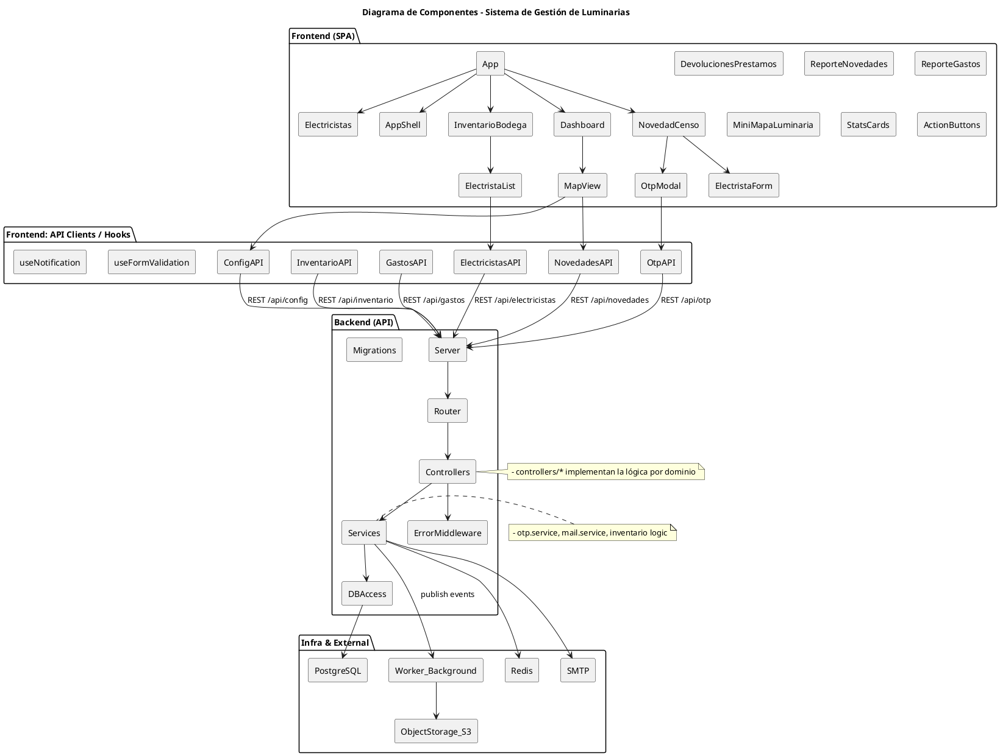

```plantuml
@startuml
title Diagrama de Componentes - Sistema de Gestión de Luminarias

skinparam componentStyle rectangle
skinparam shadowing false

' Frontend
package "Frontend (SPA)" {
  component App
  component AppShell
  component Dashboard
  component NovedadCenso
  component InventarioBodega
  component DevolucionesPrestamos
  component Electricistas
  component ReporteNovedades
  component ReporteGastos

  component MapView
  component MiniMapaLuminaria
  component ElectristaList
  component ElectristaForm
  component OtpModal
  component StatsCards
  component ActionButtons
}

' Frontend API clients
package "Frontend: API Clients / Hooks" {
  component ConfigAPI
  component InventarioAPI
  component GastosAPI
  component NovedadesAPI
  component ElectricistasAPI
  component OtpAPI
  component useFormValidation
  component useNotification
}

' Backend
package "Backend (API)" {
  component Server
  component Router
  component Controllers
  component Services
  component DBAccess
  component ErrorMiddleware
  component Migrations
}

' Infrastructure components
package "Infra & External" {
  component PostgreSQL
  component Redis
  component SMTP
  component ObjectStorage_S3
  component Worker_Background
}

' Relationships
App --> AppShell
App --> Dashboard
App --> NovedadCenso
App --> InventarioBodega
App --> Electricistas

Dashboard --> MapView
NovedadCenso --> OtpModal
NovedadCenso --> ElectristaForm
InventarioBodega --> ElectristaList

MapView --> NovedadesAPI
MapView --> ConfigAPI
ElectristaList --> ElectricistasAPI
OtpModal --> OtpAPI

' Frontend -> Backend
ConfigAPI --> Server : REST /api/config
InventarioAPI --> Server : REST /api/inventario
GastosAPI --> Server : REST /api/gastos
NovedadesAPI --> Server : REST /api/novedades
ElectricistasAPI --> Server : REST /api/electricistas
OtpAPI --> Server : REST /api/otp

' Backend internals
Server --> Router
Router --> Controllers
Controllers --> Services
Services --> DBAccess
Services --> Worker_Background : publish events
Controllers --> ErrorMiddleware

' Infra usage
DBAccess --> PostgreSQL
Services --> Redis
Services --> SMTP
Worker_Background --> ObjectStorage_S3

note right of Controllers
  - controllers/* implementan la lógica por dominio
end note

note left of Services
  - otp.service, mail.service, inventario logic
end note

@enduml
```