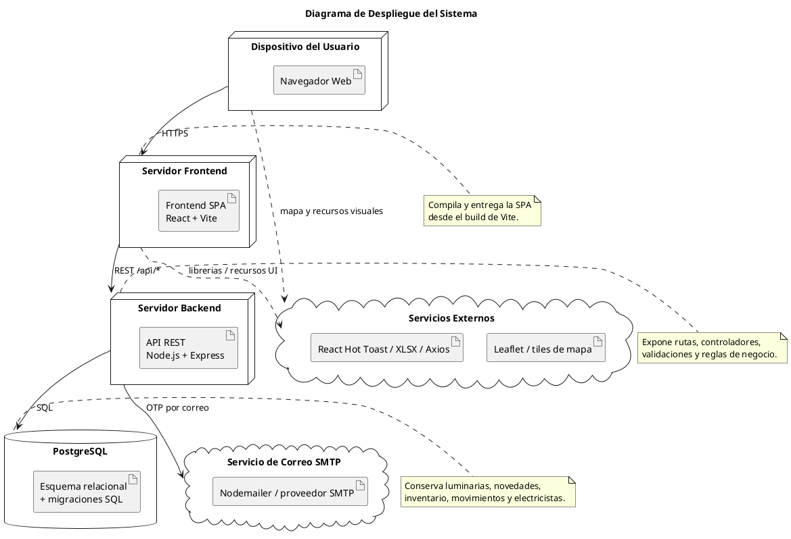

```plantuml
@startuml
title Diagrama de Despliegue del Sistema

skinparam shadowing false
skinparam componentStyle rectangle

node "Dispositivo del Usuario" as USER_DEVICE {
  artifact "Navegador Web"
}

node "Servidor Frontend" as FRONTEND_HOST {
  artifact "Frontend SPA\nReact + Vite"
}

node "Servidor Backend" as BACKEND_HOST {
  artifact "API REST\nNode.js + Express"
}

database "PostgreSQL" as DB_SERVER {
  artifact "Esquema relacional\n+ migraciones SQL"
}

cloud "Servicio de Correo SMTP" as SMTP_SERVICE {
  artifact "Nodemailer / proveedor SMTP"
}

cloud "Servicios Externos" as EXTERNAL_SERVICES {
  artifact "Leaflet / tiles de mapa"
  artifact "React Hot Toast / XLSX / Axios"
}

USER_DEVICE --> FRONTEND_HOST : HTTPS
FRONTEND_HOST --> BACKEND_HOST : REST /api/*
BACKEND_HOST --> DB_SERVER : SQL
BACKEND_HOST --> SMTP_SERVICE : OTP por correo
FRONTEND_HOST ..> EXTERNAL_SERVICES : librerias / recursos UI
USER_DEVICE ..> EXTERNAL_SERVICES : mapa y recursos visuales

note right of FRONTEND_HOST
  Compila y entrega la SPA
  desde el build de Vite.
end note

note right of BACKEND_HOST
  Expone rutas, controladores,
  validaciones y reglas de negocio.
end note

note right of DB_SERVER
  Conserva luminarias, novedades,
  inventario, movimientos y electricistas.
end note

@enduml
```