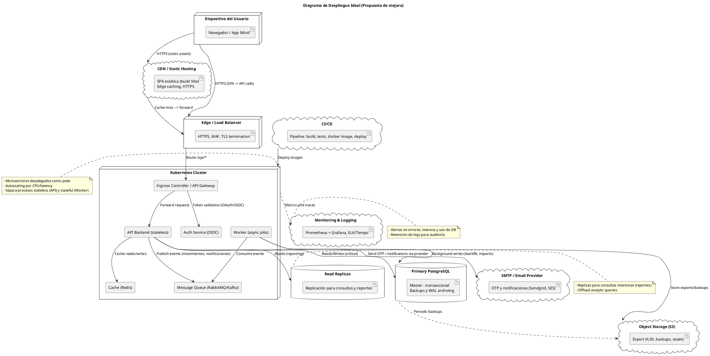

```plantuml
@startuml
title Diagrama de Despliegue Ideal (Propuesta de mejora)

skinparam shadowing false
skinparam componentStyle rectangle

' Edge: usuarios y CDN
node "Dispositivo del Usuario" as USER {
  artifact "Navegador / App Móvil"
}

cloud "CDN / Static Hosting" as CDN {
  artifact "SPA estática (build Vite)\nEdge caching, HTTPS"
}

' Ingress / Load balancing
node "Edge / Load Balancer" as LB {
  artifact "HTTPS, WAF, TLS termination"
}

' Cluster de servicios
node "Kubernetes Cluster" as K8S {
  component "Ingress Controller / API Gateway" as APIGW
  component "Auth Service (OIDC)" as AUTH
  component "API Backend (stateless)" as API
  component "Worker (async jobs)" as WORKER
  component "Cache (Redis)" as REDIS
  component "Message Queue (RabbitMQ/Kafka)" as MQ
}

database "Primary PostgreSQL" as PG_PRIMARY {
  artifact "Master - transaccional\nBackups y WAL archiving"
}

database "Read Replicas" as PG_REPLICA {
  artifact "Replicación para consultas y reportes"
}

cloud "Object Storage (S3)" as S3 {
  artifact "Export XLSX, backups, assets"
}

cloud "SMTP / Email Provider" as SMTP {
  artifact "OTP y notificaciones (Sendgrid, SES)"
}

cloud "CI/CD" as CICD {
  artifact "Pipeline: build, tests, docker image, deploy"
}

cloud "Monitoring & Logging" as MON {
  artifact "Prometheus + Grafana, ELK/Tempo"
}

' Relaciones
USER --> CDN : HTTPS (static assets)
USER --> LB : HTTPS (SPA -> API calls)
CDN --> LB : Cache miss --> forward
LB --> APIGW : Route /api/*
APIGW --> AUTH : Token validation (OAuth/OIDC)
APIGW --> API : Forward requests
API --> REDIS : Cache reads/writes
API --> PG_PRIMARY : Reads/Writes (critical)
API --> PG_REPLICA : Reads (reporting)
API --> MQ : Publish events (movimientos, notificaciones)
WORKER --> MQ : Consume events
WORKER --> PG_PRIMARY : Background writes (backfill, imports)
WORKER --> S3 : Store exports/backups
API --> SMTP : Send OTP / notifications via provider
CICD --> K8S : Deploy images
K8S ..> MON : Metrics and traces
PG_PRIMARY ..> S3 : Periodic backups

note left of K8S
  - Microservicios desplegados como pods
  - Autoscaling por CPU/latency
  - Separa procesos stateless (API) y stateful (Worker)
end note

note right of PG_REPLICA
  - Replicas para consultas intensivas (reportes)
  - Offload analytic queries
end note

note right of MON
  - Alertas en errores, latencia y uso de DB
  - Retención de logs para auditoría
end note

@enduml
```