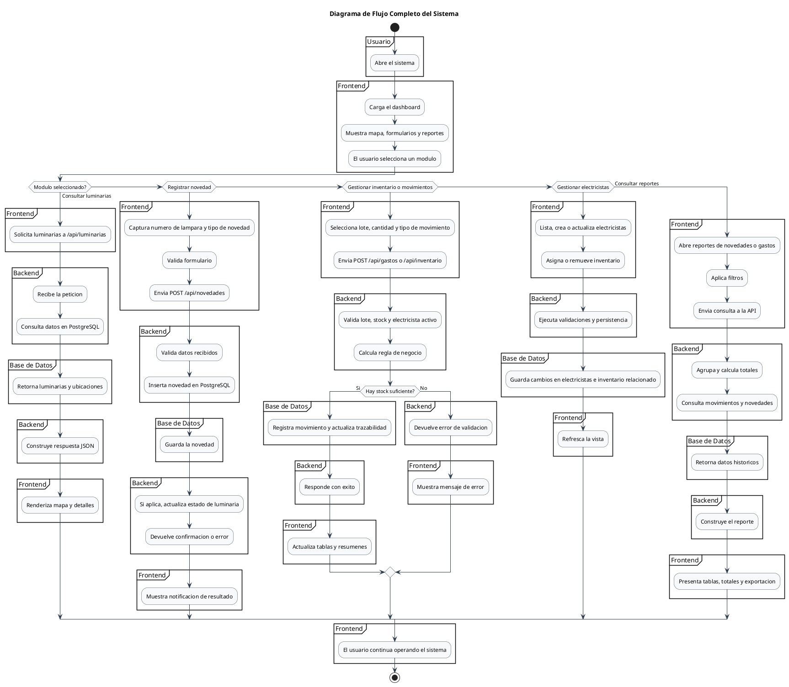

```plantuml
@startuml
title Diagrama de Flujo Completo del Sistema

skinparam backgroundColor white
skinparam activityBackgroundColor #F8F9FB
skinparam activityBorderColor #2C3E50
skinparam arrowColor #2C3E50
skinparam shadowing false

start

partition "Usuario" {
  :Abre el sistema;
}

partition "Frontend" {
  :Carga el dashboard;
  :Muestra mapa, formularios y reportes;
  :El usuario selecciona un modulo;
}

if (Modulo seleccionado?) then (Consultar luminarias)
  partition "Frontend" {
    :Solicita luminarias a /api/luminarias;
  }
  partition "Backend" {
    :Recibe la peticion;
    :Consulta datos en PostgreSQL;
  }
  partition "Base de Datos" {
    :Retorna luminarias y ubicaciones;
  }
  partition "Backend" {
    :Construye respuesta JSON;
  }
  partition "Frontend" {
    :Renderiza mapa y detalles;
  }

elseif (Registrar novedad)
  partition "Frontend" {
    :Captura numero de lampara y tipo de novedad;
    :Valida formulario;
    :Envia POST /api/novedades;
  }
  partition "Backend" {
    :Valida datos recibidos;
    :Inserta novedad en PostgreSQL;
  }
  partition "Base de Datos" {
    :Guarda la novedad;
  }
  partition "Backend" {
    :Si aplica, actualiza estado de luminaria;
    :Devuelve confirmacion o error;
  }
  partition "Frontend" {
    :Muestra notificacion de resultado;
  }

elseif (Gestionar inventario o movimientos)
  partition "Frontend" {
    :Selecciona lote, cantidad y tipo de movimiento;
    :Envia POST /api/gastos o /api/inventario;
  }
  partition "Backend" {
    :Valida lote, stock y electricista activo;
    :Calcula regla de negocio;
  }
  if (Hay stock suficiente?) then (Si)
    partition "Base de Datos" {
      :Registra movimiento y actualiza trazabilidad;
    }
    partition "Backend" {
      :Responde con exito;
    }
    partition "Frontend" {
      :Actualiza tablas y resumenes;
    }
  else (No)
    partition "Backend" {
      :Devuelve error de validacion;
    }
    partition "Frontend" {
      :Muestra mensaje de error;
    }
  endif

elseif (Gestionar electricistas)
  partition "Frontend" {
    :Lista, crea o actualiza electricistas;
    :Asigna o remueve inventario;
  }
  partition "Backend" {
    :Ejecuta validaciones y persistencia;
  }
  partition "Base de Datos" {
    :Guarda cambios en electricistas e inventario relacionado;
  }
  partition "Frontend" {
    :Refresca la vista;
  }

else (Consultar reportes)
  partition "Frontend" {
    :Abre reportes de novedades o gastos;
    :Aplica filtros;
    :Envia consulta a la API;
  }
  partition "Backend" {
    :Agrupa y calcula totales;
    :Consulta movimientos y novedades;
  }
  partition "Base de Datos" {
    :Retorna datos historicos;
  }
  partition "Backend" {
    :Construye el reporte;
  }
  partition "Frontend" {
    :Presenta tablas, totales y exportacion;
  }
endif

partition "Frontend" {
  :El usuario continua operando el sistema;
}

stop
@enduml
```