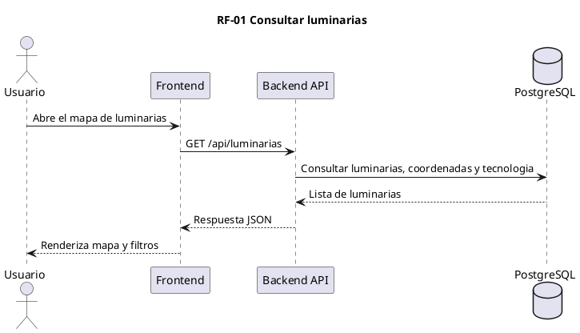
```plantuml
@startuml
title RF-01 Consultar luminarias
actor Usuario
participant "Frontend" as FE
participant "Backend API" as BE
database "PostgreSQL" as DB

Usuario -> FE: Abre el mapa de luminarias
FE -> BE: GET /api/luminarias
BE -> DB: Consultar luminarias, coordenadas y tecnologia
DB --> BE: Lista de luminarias
BE --> FE: Respuesta JSON
FE --> Usuario: Renderiza mapa y filtros
@enduml
```

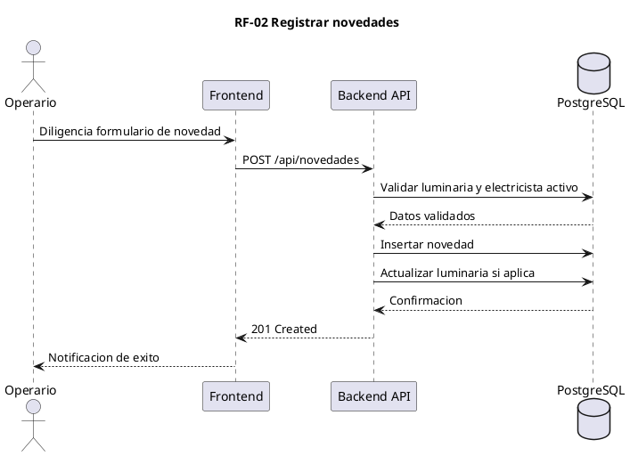
```plantuml
@startuml
title RF-02 Registrar novedades
actor Operario
participant "Frontend" as FE
participant "Backend API" as BE
database "PostgreSQL" as DB

Operario -> FE: Diligencia formulario de novedad
FE -> BE: POST /api/novedades
BE -> DB: Validar luminaria y electricista activo
DB --> BE: Datos validados
BE -> DB: Insertar novedad
BE -> DB: Actualizar luminaria si aplica
DB --> BE: Confirmacion
BE --> FE: 201 Created
FE --> Operario: Notificacion de exito
@enduml
```

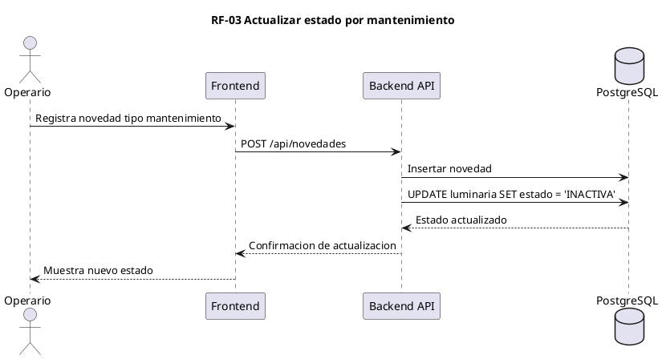
```plantuml
@startuml
title RF-03 Actualizar estado por mantenimiento
actor Operario
participant "Frontend" as FE
participant "Backend API" as BE
database "PostgreSQL" as DB

Operario -> FE: Registra novedad tipo mantenimiento
FE -> BE: POST /api/novedades
BE -> DB: Insertar novedad
BE -> DB: UPDATE luminaria SET estado = 'INACTIVA'
DB --> BE: Estado actualizado
BE --> FE: Confirmacion de actualizacion
FE --> Operario: Muestra nuevo estado
@enduml
```

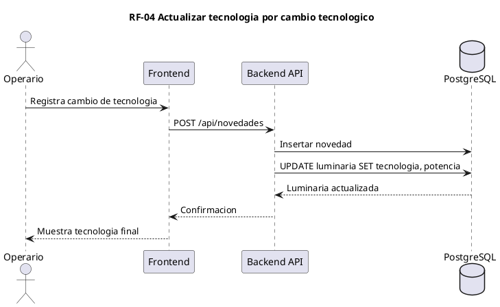
```plantuml
@startuml
title RF-04 Actualizar tecnologia por cambio tecnologico
actor Operario
participant "Frontend" as FE
participant "Backend API" as BE
database "PostgreSQL" as DB

Operario -> FE: Registra cambio de tecnologia
FE -> BE: POST /api/novedades
BE -> DB: Insertar novedad
BE -> DB: UPDATE luminaria SET tecnologia, potencia
DB --> BE: Luminaria actualizada
BE --> FE: Confirmacion
FE --> Operario: Muestra tecnologia final
@enduml
```

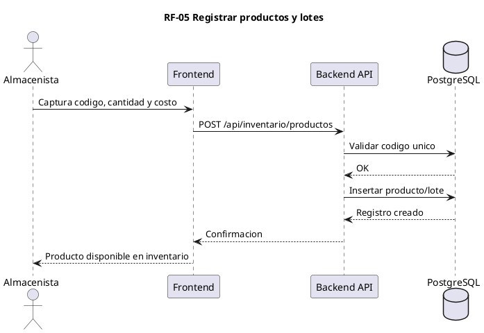
```plantuml
@startuml
title RF-05 Registrar productos y lotes
actor Almacenista
participant "Frontend" as FE
participant "Backend API" as BE
database "PostgreSQL" as DB

Almacenista -> FE: Captura codigo, cantidad y costo
FE -> BE: POST /api/inventario/productos
BE -> DB: Validar codigo unico
DB --> BE: OK
BE -> DB: Insertar producto/lote
DB --> BE: Registro creado
BE --> FE: Confirmacion
FE --> Almacenista: Producto disponible en inventario
@enduml
```

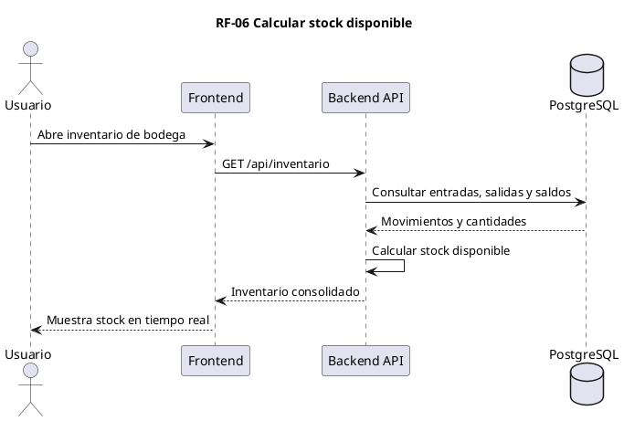
```plantuml
@startuml
title RF-06 Calcular stock disponible
actor Usuario
participant "Frontend" as FE
participant "Backend API" as BE
database "PostgreSQL" as DB

Usuario -> FE: Abre inventario de bodega
FE -> BE: GET /api/inventario
BE -> DB: Consultar entradas, salidas y saldos
DB --> BE: Movimientos y cantidades
BE -> BE: Calcular stock disponible
BE --> FE: Inventario consolidado
FE --> Usuario: Muestra stock en tiempo real
@enduml
```

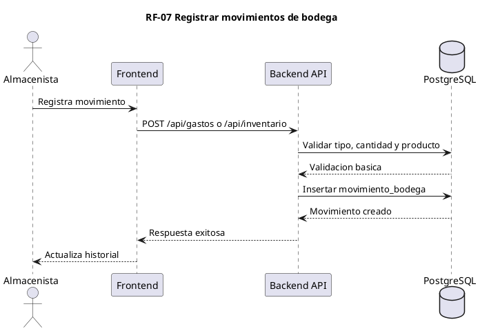
```plantuml
@startuml
title RF-07 Registrar movimientos de bodega
actor Almacenista
participant "Frontend" as FE
participant "Backend API" as BE
database "PostgreSQL" as DB

Almacenista -> FE: Registra movimiento
FE -> BE: POST /api/gastos o /api/inventario
BE -> DB: Validar tipo, cantidad y producto
DB --> BE: Validacion basica
BE -> DB: Insertar movimiento_bodega
DB --> BE: Movimiento creado
BE --> FE: Respuesta exitosa
FE --> Almacenista: Actualiza historial
@enduml
```

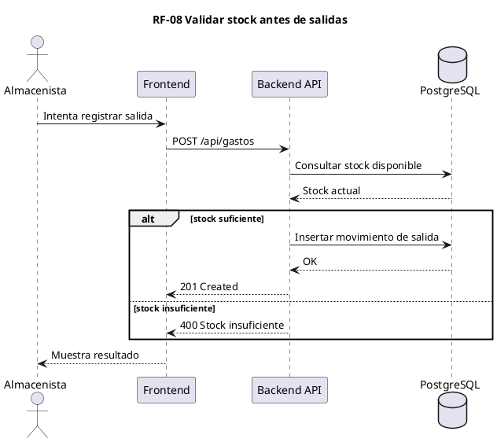
```plantuml
@startuml
title RF-08 Validar stock antes de salidas
actor Almacenista
participant "Frontend" as FE
participant "Backend API" as BE
database "PostgreSQL" as DB

Almacenista -> FE: Intenta registrar salida
FE -> BE: POST /api/gastos
BE -> DB: Consultar stock disponible
DB --> BE: Stock actual

alt stock suficiente
  BE -> DB: Insertar movimiento de salida
  DB --> BE: OK
  BE --> FE: 201 Created
else stock insuficiente
  BE --> FE: 400 Stock insuficiente
end

FE --> Almacenista: Muestra resultado
@enduml
```

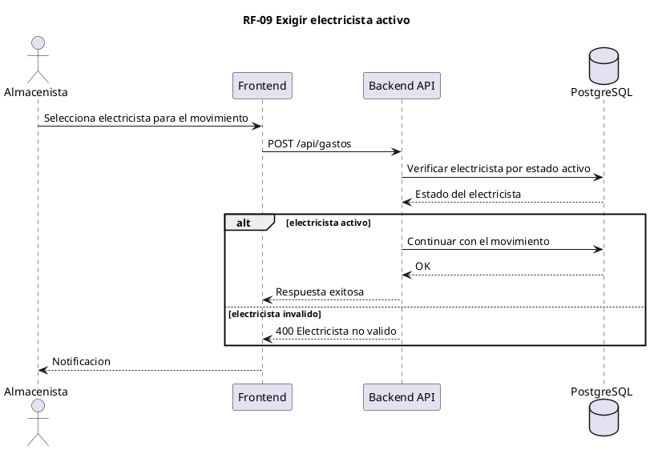
```plantuml
@startuml
title RF-09 Exigir electricista activo
actor Almacenista
participant "Frontend" as FE
participant "Backend API" as BE
database "PostgreSQL" as DB

Almacenista -> FE: Selecciona electricista para el movimiento
FE -> BE: POST /api/gastos
BE -> DB: Verificar electricista por estado activo
DB --> BE: Estado del electricista

alt electricista activo
  BE -> DB: Continuar con el movimiento
  DB --> BE: OK
  BE --> FE: Respuesta exitosa
else electricista invalido
  BE --> FE: 400 Electricista no valido
end

FE --> Almacenista: Notificacion
@enduml
```

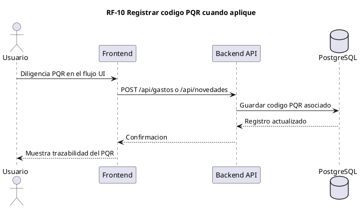
```plantuml
@startuml
title RF-10 Registrar codigo PQR cuando aplique
actor Usuario
participant "Frontend" as FE
participant "Backend API" as BE
database "PostgreSQL" as DB

Usuario -> FE: Diligencia PQR en el flujo UI
FE -> BE: POST /api/gastos o /api/novedades
BE -> DB: Guardar codigo PQR asociado
DB --> BE: Registro actualizado
BE --> FE: Confirmacion
FE --> Usuario: Muestra trazabilidad del PQR
@enduml
```

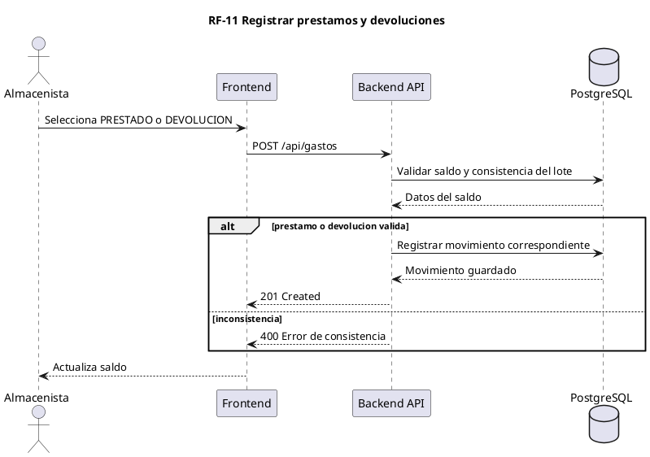
```plantuml
@startuml
title RF-11 Registrar prestamos y devoluciones
actor Almacenista
participant "Frontend" as FE
participant "Backend API" as BE
database "PostgreSQL" as DB

Almacenista -> FE: Selecciona PRESTADO o DEVOLUCION
FE -> BE: POST /api/gastos
BE -> DB: Validar saldo y consistencia del lote
DB --> BE: Datos del saldo

alt prestamo o devolucion valida
  BE -> DB: Registrar movimiento correspondiente
  DB --> BE: Movimiento guardado
  BE --> FE: 201 Created
else inconsistencia
  BE --> FE: 400 Error de consistencia
end

FE --> Almacenista: Actualiza saldo
@enduml
```

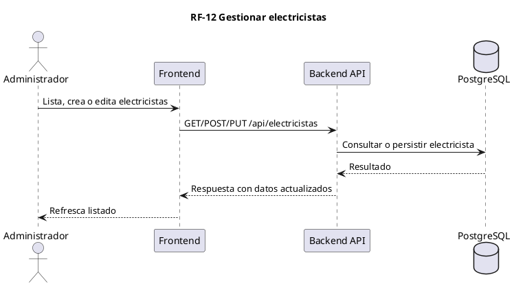
```plantuml
@startuml
title RF-12 Gestionar electricistas
actor Administrador
participant "Frontend" as FE
participant "Backend API" as BE
database "PostgreSQL" as DB

Administrador -> FE: Lista, crea o edita electricistas
FE -> BE: GET/POST/PUT /api/electricistas
BE -> DB: Consultar o persistir electricista
DB --> BE: Resultado
BE --> FE: Respuesta con datos actualizados
FE --> Administrador: Refresca listado
@enduml
```

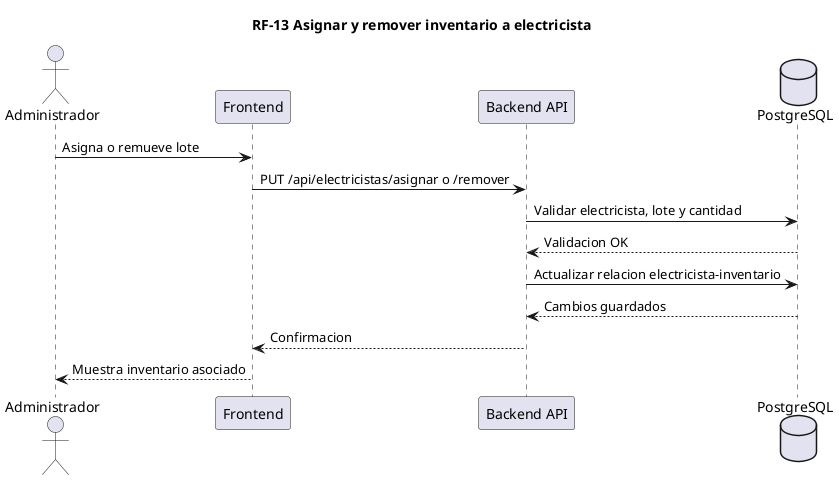
```plantuml
@startuml
title RF-13 Asignar y remover inventario a electricista
actor Administrador
participant "Frontend" as FE
participant "Backend API" as BE
database "PostgreSQL" as DB

Administrador -> FE: Asigna o remueve lote
FE -> BE: PUT /api/electricistas/asignar o /remover
BE -> DB: Validar electricista, lote y cantidad
DB --> BE: Validacion OK
BE -> DB: Actualizar relacion electricista-inventario
DB --> BE: Cambios guardados
BE --> FE: Confirmacion
FE --> Administrador: Muestra inventario asociado
@enduml
```

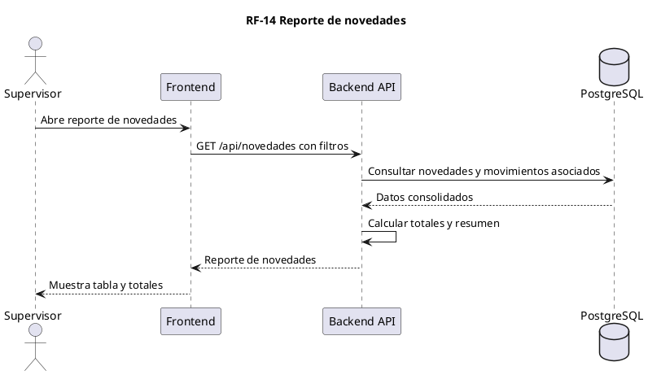
```plantuml
@startuml
title RF-14 Reporte de novedades
actor Supervisor
participant "Frontend" as FE
participant "Backend API" as BE
database "PostgreSQL" as DB

Supervisor -> FE: Abre reporte de novedades
FE -> BE: GET /api/novedades con filtros
BE -> DB: Consultar novedades y movimientos asociados
DB --> BE: Datos consolidados
BE -> BE: Calcular totales y resumen
BE --> FE: Reporte de novedades
FE --> Supervisor: Muestra tabla y totales
@enduml
```

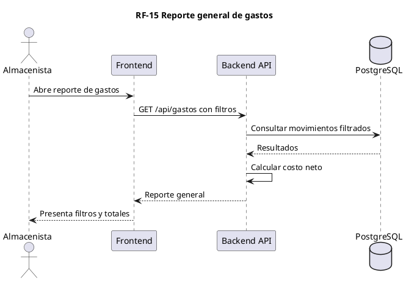
```plantuml
@startuml
title RF-15 Reporte general de gastos
actor Almacenista
participant "Frontend" as FE
participant "Backend API" as BE
database "PostgreSQL" as DB

Almacenista -> FE: Abre reporte de gastos
FE -> BE: GET /api/gastos con filtros
BE -> DB: Consultar movimientos filtrados
DB --> BE: Resultados
BE -> BE: Calcular costo neto
BE --> FE: Reporte general
FE --> Almacenista: Presenta filtros y totales
@enduml
```

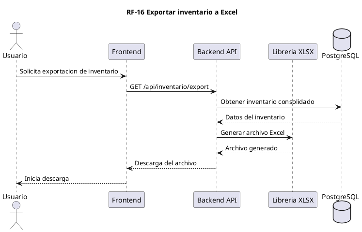
```plantuml
@startuml
title RF-16 Exportar inventario a Excel
actor Usuario
participant "Frontend" as FE
participant "Backend API" as BE
participant "Libreria XLSX" as XLSX
database "PostgreSQL" as DB

Usuario -> FE: Solicita exportacion de inventario
FE -> BE: GET /api/inventario/export
BE -> DB: Obtener inventario consolidado
DB --> BE: Datos del inventario
BE -> XLSX: Generar archivo Excel
XLSX --> BE: Archivo generado
BE --> FE: Descarga del archivo
FE --> Usuario: Inicia descarga
@enduml
```

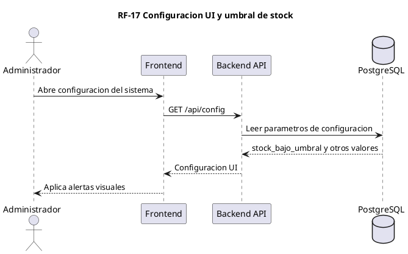
```plantuml
@startuml
title RF-17 Configuracion UI y umbral de stock
actor Administrador
participant "Frontend" as FE
participant "Backend API" as BE
database "PostgreSQL" as DB

Administrador -> FE: Abre configuracion del sistema
FE -> BE: GET /api/config
BE -> DB: Leer parametros de configuracion
DB --> BE: stock_bajo_umbral y otros valores
BE --> FE: Configuracion UI
FE --> Administrador: Aplica alertas visuales
@enduml
```