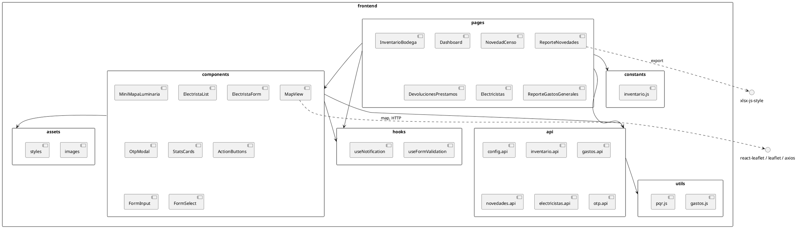

```plantuml
@startuml
skinparam packageStyle rectangle
skinparam classAttributeIconSize 0

package "frontend" {
  package "pages" {
    [Dashboard]
    [NovedadCenso]
    [InventarioBodega]
    [DevolucionesPrestamos]
    [Electricistas]
    [ReporteNovedades]
    [ReporteGastosGenerales]
  }

  package "components" {
    [MapView]
    [MiniMapaLuminaria]
    [ElectristaList]
    [ElectristaForm]
    [OtpModal]
    [StatsCards]
    [ActionButtons]
    [FormInput]
    [FormSelect]
  }

  package "api" {
    [config.api]
    [inventario.api]
    [gastos.api]
    [novedades.api]
    [electricistas.api]
    [otp.api]
  }

  package "hooks" {
    [useFormValidation]
    [useNotification]
  }

  package "utils" {
    [gastos.js]
    [pqr.js]
  }

  package "constants" {
    [inventario.js]
  }

  package "assets" {
    [images]
    [styles]
  }
}

' Dependencies between packages
pages --> components
pages --> api
components --> api
components --> hooks
pages --> hooks
api --> utils
components --> assets
pages --> constants

' External libraries used
[MapView] ..> "react-leaflet / leaflet / axios" : map, HTTP
[ReporteNovedades] ..> "xlsx-js-style" : export

@enduml
```
