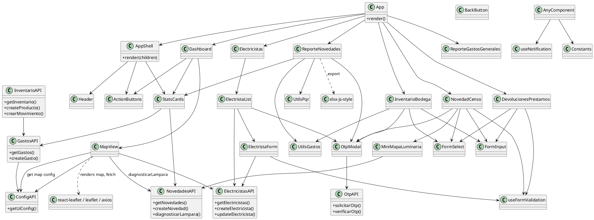

```plantuml
@startuml
skinparam classAttributeIconSize 0

' App and routing
class App {
  +render()
}
class AppShell {
  +render(children)
}

' Pages
class Dashboard
class NovedadCenso
class InventarioBodega
class DevolucionesPrestamos
class Electricistas
class ReporteNovedades
class ReporteGastosGenerales

' Components
class MapView
class MiniMapaLuminaria
class ElectristaList
class ElectristaForm
class OtpModal
class StatsCards
class ActionButtons
class FormInput
class FormSelect
class Header
class BackButton

' APIs (frontend wrappers)
class ConfigAPI {
  +getUiConfig()
}
class InventarioAPI {
  +getInventario()
  +createProducto()
  +crearMovimiento()
}
class GastosAPI {
  +getGastos()
  +createGasto()
}
class NovedadesAPI {
  +getNovedades()
  +createNovedad()
  +diagnosticarLampara()
}
class ElectricistasAPI {
  +getElectricistas()
  +createElectricista()
  +updateElectricista()
}
class OtpAPI {
  +solicitarOtp()
  +verificarOtp()
}

' Hooks and utils
class useFormValidation
class useNotification
class UtilsGastos
class UtilsPqr
class Constants

' App composition
App --> AppShell
App --> Dashboard
App --> NovedadCenso
App --> InventarioBodega
App --> DevolucionesPrestamos
App --> Electricistas
App --> ReporteNovedades
App --> ReporteGastosGenerales

' AppShell composition
AppShell --> Header
AppShell --> ActionButtons
AppShell --> StatsCards

' Pages use components
Dashboard --> MapView
Dashboard --> ActionButtons
Dashboard --> StatsCards
NovedadCenso --> MiniMapaLuminaria
NovedadCenso --> OtpModal
NovedadCenso --> FormInput
NovedadCenso --> FormSelect
InventarioBodega --> OtpModal
InventarioBodega --> FormInput
InventarioBodega --> FormSelect
DevolucionesPrestamos --> FormInput
DevolucionesPrestamos --> FormSelect
Electricistas --> ElectristaList
ElectristaList --> ElectristaForm
ElectristaList --> OtpModal
ReporteNovedades --> OtpModal
ReporteNovedades --> StatsCards

' Components call APIs
MapView --> ConfigAPI : get map config
MapView --> ConfigAPI
MapView --> NovedadesAPI : diagnosticarLampara
MapView --> ElectricistasAPI
MiniMapaLuminaria --> NovedadesAPI
ElectristaList --> ElectricistasAPI
ElectristaForm --> ElectricistasAPI
OtpModal --> OtpAPI
StatsCards --> NovedadesAPI
StatsCards --> GastosAPI

' API composition
InventarioAPI --> GastosAPI
GastosAPI --> ConfigAPI

' Hooks and utils usage
ElectristaForm --> useFormValidation
NovedadCenso --> useFormValidation
DevolucionesPrestamos --> useFormValidation
AnyComponent --> useNotification
ReporteNovedades --> UtilsGastos
ReporteNovedades --> UtilsPqr
InventarioBodega --> UtilsGastos
AnyComponent --> Constants

' External libs (axios, react-leaflet, xlsx) - optional
MapView ..> "react-leaflet / leaflet / axios" : renders map, fetch
ReporteNovedades ..> "xlsx-js-style" : export

@enduml
```
