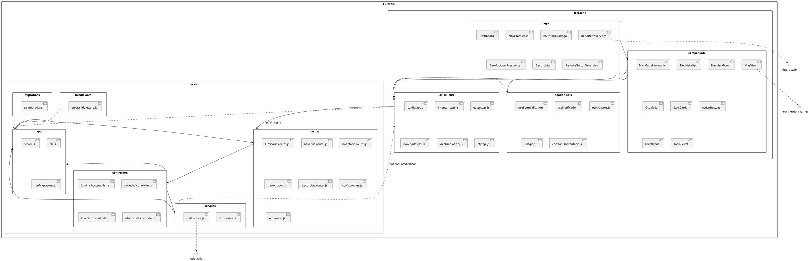

```plantuml
@startuml
skinparam packageStyle rectangle
skinparam classAttributeIconSize 0

package "Fullstack" {

  package "frontend" {
    package "pages" as FRONTEND_PAGES {
      [Dashboard]
      [NovedadCenso]
      [InventarioBodega]
      [DevolucionesPrestamos]
      [Electricistas]
      [ReporteNovedades]
      [ReporteGastosGenerales]
    }

    package "components" as FRONTEND_COMPONENTS {
      [MapView]
      [MiniMapaLuminaria]
      [ElectristaList]
      [ElectristaForm]
      [OtpModal]
      [StatsCards]
      [ActionButtons]
      [FormInput]
      [FormSelect]
    }

    package "api (client)" as FRONTEND_API_CLIENT {
      [config.api.js]
      [inventario.api.js]
      [gastos.api.js]
      [novedades.api.js]
      [electricistas.api.js]
      [otp.api.js]
    }

    package "hooks / utils" as FRONTEND_UTILS {
      [useFormValidation]
      [useNotification]
      [utils/gastos.js]
      [utils/pqr.js]
      [constants/inventario.js]
    }
  }

  package "backend" {
    package "app" as BACKEND_APP {
      [server.js]
      [db.js]
      [runMigrations.js]
    }

    package "routes" as BACKEND_ROUTES {
      [luminaria.routes.js]
      [novedad.routes.js]
      [inventario.routes.js]
      [gasto.routes.js]
      [electricista.routes.js]
      [config.routes.js]
      [otp.routes.js]
    }

    package "controllers" as BACKEND_CONTROLLERS {
      [luminaria.controller.js]
      [novedad.controller.js]
      [inventario.controller.js]
      [electricista.controller.js]
      [novedad.controller.js]
    }

    package "services" as BACKEND_SERVICES {
      [otp.service.js]
      [mail.service.js]
    }

    package "middleware" as BACKEND_MIDDLEWARE {
      [error.middleware.js]
    }

    package "migrations" as BACKEND_MIGRATIONS {
      [sql migrations]
    }
  }

}

' Package dependencies
FRONTEND_PAGES --> FRONTEND_COMPONENTS
FRONTEND_PAGES --> FRONTEND_API_CLIENT
FRONTEND_COMPONENTS --> FRONTEND_API_CLIENT
FRONTEND_COMPONENTS --> FRONTEND_UTILS

FRONTEND_API_CLIENT --> BACKEND_ROUTES : HTTP (REST)
FRONTEND_API_CLIENT ..> BACKEND_APP

BACKEND_APP --> BACKEND_ROUTES
BACKEND_ROUTES --> BACKEND_CONTROLLERS
BACKEND_CONTROLLERS --> BACKEND_SERVICES
BACKEND_CONTROLLERS --> BACKEND_APP
BACKEND_SERVICES --> BACKEND_APP
BACKEND_MIDDLEWARE --> BACKEND_APP
BACKEND_MIGRATIONS --> BACKEND_APP

' Cross-cutting
FRONTEND_UTILS ..> FRONTEND_API_CLIENT
BACKEND_SERVICES ..> FRONTEND_API_CLIENT : (optional) notifications

' External libs
[MapView] ..> "react-leaflet / leaflet / axios"
[ReporteNovedades] ..> "xlsx-js-style"
[mail.service.js] ..> "nodemailer"

@enduml
```
